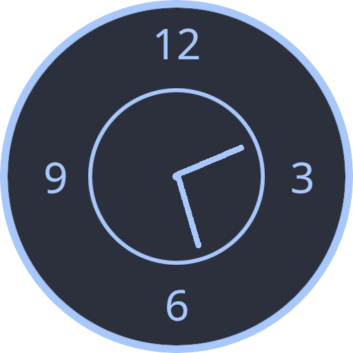
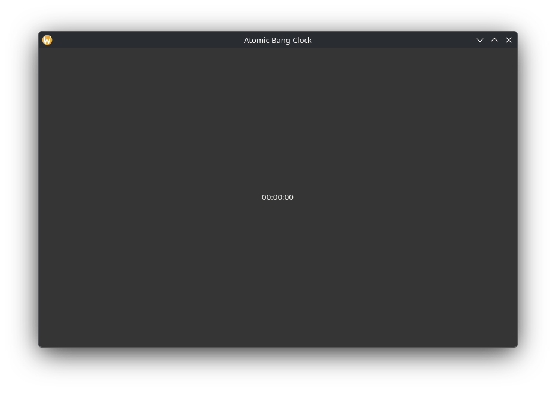
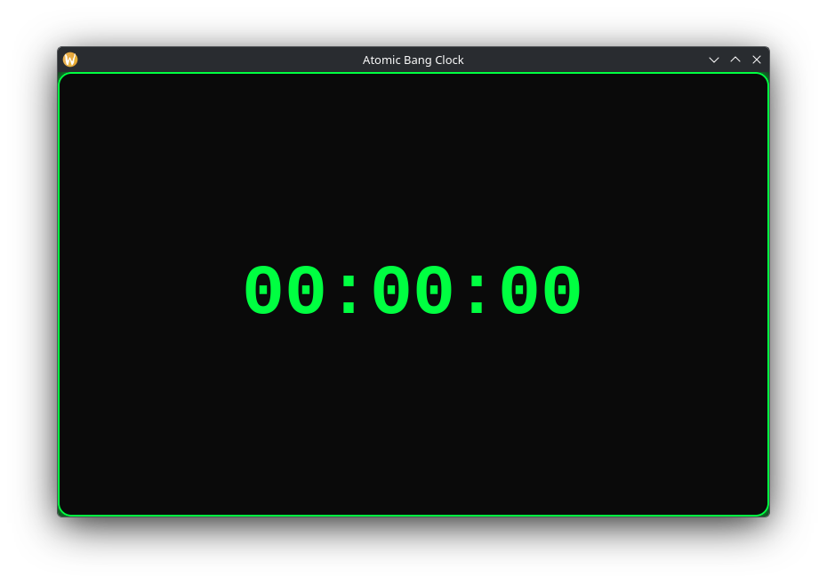
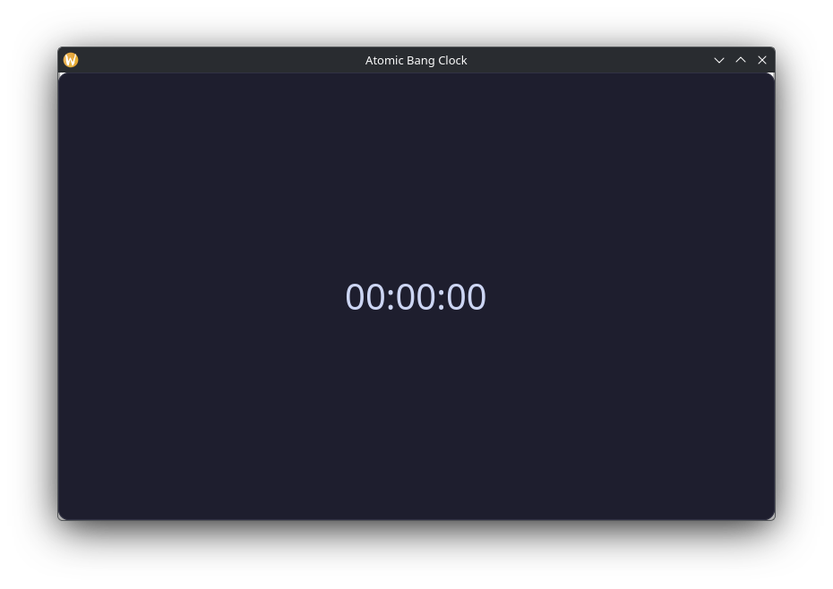

<a id="readme-top"></a>

<!-- PROJECT LOGO -->

<div align="center">
  <a href="https://github.com/lutherhistory/atomic-bang-clock">
    
  </a>

  <h3 align="center">Atomic Bang Clock</h3>

  <p align="center">
    A simple GTK4 desktop time management app for Linux.
  </p>
</div>

</br>

<!-- BADGES -->

<div align="center">

  <a href="https://github.com/lutherhistory/atomic-bang-clock/stargazers">
    
  </a>

  <a href="https://github.com/lutherhistory/atomic-bang-clock/blob/main/LICENSE">
    
  </a>

  <a href="https://github.com/lutherhistory/atomic-bang-clock/releases">
    
  </a>

  <br />

  
  
  
  

</div>

---

<!-- TABLE OF CONTENTS -->

<details>
  <summary>Table of Contents</summary>

  <ol>
    <li>
      <a href="#about-the-project">About The Project</a>
      <ul>
        <li><a href="#features">Features</a></li>
        <li><a href="#built-with">Built With</a></li>
      </ul>
    </li>
    <li>
      <a href="#getting-started">Getting Started</a>
      <ul>
        <li><a href="#prerequisites">Prerequisites</a></li>
        <li><a href="#build">Build</a></li>
      </ul>
    </li>
    <li><a href="#usage">Usage</a></li>
    <li><a href="#screenshots">Screenshots</a></li>
    <li><a href="#roadmap">Roadmap</a></li>
    <li><a href="#license">License</a></li>
    <li><a href="#acknowledgements">Acknowledgements</a></li>
  </ol>
</details>

<!-- ABOUT THE PROJECT -->

## About The Project


Atomic Bang Clock is a simple desktop time management application for Linux.

It is built with **C**, **GTK4**, and **GStreamer**.

The project started as a small experiment and is slowly growing into a useful desktop application.

### Features

* 🕐 Display the current time
* ⏳ Countdown timer
* 🔔 Alarm
* 🔊 Alarm sound playback
* ⌨️ Keyboard controls
* 🎨 Custom GTK4 interface
* 🪶 Lightweight native application

The main goal is to keep the application **simple, lightweight, and easy to use**.

<p align="right">(<a href="#readme-top">back to top</a>)</p>

---

<!-- BUILT WITH -->

### Built With

* [C](https://en.wikipedia.org/wiki/C_%28programming_language%29)
* [GTK4](https://www.gtk.org/)
* [GStreamer](https://gstreamer.freedesktop.org/)
* [GNU Make](https://www.gnu.org/software/make/)

<p align="right">(<a href="#readme-top">back to top</a>)</p>

---

<!-- GETTING STARTED -->

## Getting Started

To build Atomic Bang Clock from source, follow the steps below.

### Prerequisites

You need the following tools and libraries:

* **GCC**
* **GNU Make**
* **GTK4**
* **GStreamer**
* **pkg-config**

Make sure they are installed on your Linux system before building.

### Install Dependencies

**Ubuntu / Debian**

```bash
sudo apt install build-essential libgtk-4-dev libgstreamer1.0-dev libgstreamer-plugins-base1.0-dev pkg-config
```

**Fedora**

```bash
sudo dnf install gcc make gtk4-devel gstreamer1-devel gstreamer1-plugins-base-devel pkg-config
```

**Arch Linux**

```bash
sudo pacman -S base-devel gtk4 gstreamer gst-plugins-base pkg-config
```

### Build

Clone the repository:

```bash
git clone https://github.com/lutherhistory/atomic-bang-clock.git
cd atomic-bang-clock
```

Build the application:

```bash
make
```

The compiled application will be available at:

```text
build/atomic-bang-clock
```

<p align="right">(<a href="#readme-top">back to top</a>)</p>

---

<!-- USAGE -->

## Usage

Run the application with:

```bash
make run
```

You can use Atomic Bang Clock to:

* View the current time
* Run countdowns
* Set alarms
* Play alarm sounds
* Control the timer with the keyboard

<p align="right">(<a href="#readme-top">back to top</a>)</p>

---

<!-- SCREENSHOTS -->

## Screenshots

<details>
  <summary>View Screenshots</summary>

  <br>

  <p align="center">
    
    
    
  </p>

</details>

<p align="right">(<a href="#readme-top">back to top</a>)</p>

---

<!-- ROADMAP -->

## Roadmap

* [x] Basic clock
* [x] Countdown timer
* [x] Alarm
* [x] Alarm sound playback
* [x] Keyboard controls
* [ ] Background operation
* [ ] Desktop notifications
* [ ] Configuration
* [ ] Installation support
* [ ] More time management features

<p align="right">(<a href="#readme-top">back to top</a>)</p>

---

<!-- LICENSE -->

## License

Distributed under the **Unlicense License**.

See `LICENSE` for more information.

### Contributions

This project is **open source and free to use**, but **contributions are not being accepted** at this time.

Feel free to fork it, learn from it, or use the code in your own projects, while respecting the license.

<p align="right">(<a href="#readme-top">back to top</a>)</p>

---

<!-- ACKNOWLEDGEMENTS -->

## Acknowledgements

I used ChatGPT to help write this `README.md` because English isn't my strong suit.

The code and development are my own. I only used AI for questions, research, and help with solving some unusual bugs.

Thanks to the open-source frameworks and resources that helped make this project possible:

* [GTK](https://www.gtk.org/) — GUI framework
* [GStreamer](https://gstreamer.freedesktop.org/) — multimedia framework
* [Best-README-Template](https://github.com/othneildrew/Best-README-Template) — README template
* [Pixabay](https://pixabay.com/) — audio assets

<p align="right">(<a href="#readme-top">back to top</a>)</p>

---

<!-- PROJECT LINKS -->

<p align="center">
  <a href="https://github.com/lutherhistory/atomic-bang-clock/issues">Report a Bug</a>
  &middot;
  <a href="https://github.com/lutherhistory/atomic-bang-clock/issues">Request a Feature</a>
  &middot;
  <a href="https://github.com/lutherhistory/atomic-bang-clock">View Repository</a>
</p>
