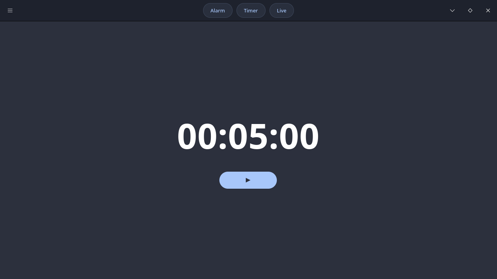

# Development Updates

## 2026-09-09 — UI Prototype

Current UI:

### Changes

- Redesigned the headerbar
- Added mode buttons
- Improved clock display
- Added play/pause button

---

## 2026-09-07 — Initial UI

### Changes

- Created the initial GTK4 layout
- Added clock display
- Added basic controls
